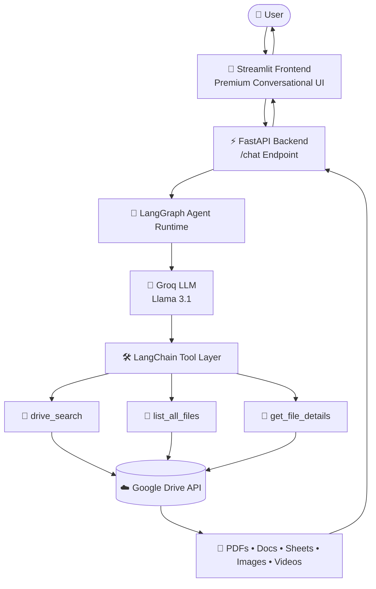
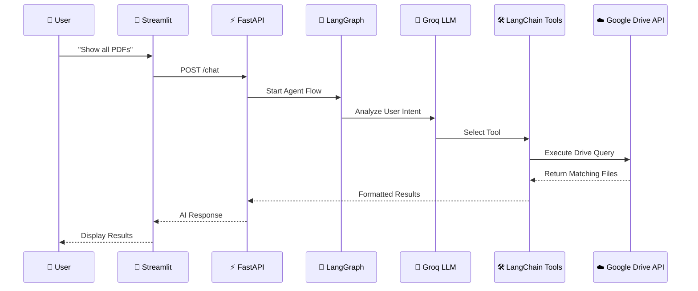

````md
# 🗂️ TailorTalk AI — Conversational Google Drive Discovery Agent

<div align="center">


<br>

### ⚡ AI-Powered File Discovery using LangGraph, FastAPI, LangChain & Google Drive API

<p align="center">


</p>

---

### 🧠 Natural Language → Intelligent Drive Retrieval

```bash
Show all PDFs
Find invoices from 2024
Search finance documents
List spreadsheets
Find images uploaded recently
````

</div>

---

# ✨ System Architecture

<div align="center">



</div>

---

# ⚡ Agent Workflow

<div align="center">



</div>

---

# 🚀 Features

* 🧠 Conversational AI-powered Google Drive search
* ⚡ LangGraph agent orchestration
* 🛠️ LangChain tool calling
* 🔎 Dynamic Google Drive `q` query generation
* 📄 PDF, Docs, Sheets, Images & Video discovery
* 📅 Date-based file filtering
* 🔗 Direct Google Drive links
* ☁️ Cloud deployment on Render + Streamlit
* 🎨 Premium futuristic chat interface
* 🔒 Secure Google Service Account authentication

---

# 🧩 Tech Stack

| Layer           | Technology               |
| --------------- | ------------------------ |
| Frontend        | Streamlit                |
| Backend         | FastAPI                  |
| Agent Framework | LangGraph                |
| Tool Framework  | LangChain                |
| LLM             | Groq Llama 3.1           |
| API Integration | Google Drive API         |
| Deployment      | Render + Streamlit Cloud |

---

# 📂 Project Structure

```bash
TailorTalk/
│
├── backend/
│   ├── main.py
│   ├── agent.py
│   ├── requirements.txt
│   └── render.yaml
│
├── frontend/
│   ├── app.py
│   ├── requirements.txt
│   └── .streamlit/
│
├── runtime.txt
├── README.md
└── service_account.json
```

---

# ⚙️ Local Setup

## 1️⃣ Clone Repository

```bash
git clone YOUR_REPO_URL

cd TailorTalk
```

---

## 2️⃣ Backend Setup

```bash
cd backend

pip install -r requirements.txt

uvicorn main:app --reload --port 8000
```

Backend runs on:

```bash
http://localhost:8000
```

---

## 3️⃣ Frontend Setup

```bash
cd frontend

pip install -r requirements.txt

streamlit run app.py
```

Frontend runs on:

```bash
http://localhost:8501
```

---

# 🔑 Environment Variables

## Backend `.env`

```env
GROQ_API_KEY=your_groq_api_key

GOOGLE_DRIVE_FOLDER_ID=your_drive_folder_id

SERVICE_ACCOUNT_FILE=service_account.json
```

---

# ☁️ Deployment

# 🚀 Render Backend Deployment

### Build Command

```bash
pip install -r requirements.txt
```

### Start Command

```bash
uvicorn main:app --host 0.0.0.0 --port $PORT
```

---

# 🎨 Streamlit Deployment

Main file:

```bash
frontend/app.py
```

Python version:

```bash
3.11
```

---

# ⚠️ Render Free Tier Notes

Render free instances automatically sleep after inactivity.

⏳ Initial wake-up requests may take:

```bash
30–50 seconds
```

After warm-up:
⚡ responses become fast again.

---

# 🧪 Example Queries

```bash
Show all PDFs

Find invoices

List images

Show spreadsheets

Find finance files

Search documents from 2024
```

---

# 🔍 Example Generated Drive Queries

| User Prompt      | Generated Query                      |
| ---------------- | ------------------------------------ |
| Show PDFs        | mimeType='application/pdf'           |
| Find invoices    | name contains 'invoice'              |
| Finance docs     | fullText contains 'finance'          |
| Images           | mimeType contains 'image/'           |
| Files after 2024 | modifiedTime > '2024-01-01T00:00:00' |

---

# 🔐 Security

* Read-only Google Drive access
* Service Account authentication
* Environment variable protection
* Secret file deployment support

---

# 📈 Future Improvements

* 🔎 Semantic vector search
* 📄 OCR-powered search
* 🧠 RAG document Q&A
* 🎤 Voice assistant integration
* ⚡ Streaming responses
* 🗃️ Multi-folder indexing
* 📊 Analytics dashboard

---

# 👨‍💻 Author

## Mohamed Shalman Kursheeth

AI Engineer • Backend Developer • Full Stack Developer

---

<div align="center">

# 🚀 TailorTalk AI

### Conversational Google Drive Intelligence

Built with ❤️ using LangGraph, LangChain, FastAPI, Groq & Google Drive API

</div>
```
